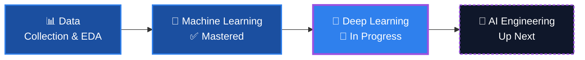

<h1>Hey, I'm Tasrif Mahin</h1>

 

&nbsp;&nbsp;&nbsp;
&nbsp;&nbsp;&nbsp;
&nbsp;&nbsp;&nbsp;
&nbsp;&nbsp;&nbsp;
&nbsp;&nbsp;&nbsp;
&nbsp;&nbsp;&nbsp;

 

## 🧑‍💻 About Me

I'm a **Computer Science undergraduate** specializing in **Machine Learning, Deep Learning, and Artificial Intelligence** — focused on building models that solve real problems, not just pass coursework.

- 🎓 Computer Science undergraduate with a strong, self-driven ML foundation
- 🤖 Progressing methodically from Machine Learning into Deep Learning and AI
- 🐍 Proficient with Python, NumPy, Pandas, and Scikit-learn for end-to-end data workflows
- 💼 Actively seeking **Machine Learning Internship** opportunities to apply this expertise
- 🌱 Driven by a build-first mindset: rapid iteration, disciplined learning, continuous improvement

 

## 🛠️ Tech Stack

<table>
<tr>
<td valign="top" width="50%">

**Languages**

</td>
<td valign="top" width="50%">

**Data Science & ML**

</td>
</tr>
<tr>
<td valign="top">

**Tools**

</td>
<td valign="top">

**Core ML Concepts**

`Supervised Learning` `Unsupervised Learning`
`Regression` `Classification`
`EDA` `Feature Engineering` `Model Evaluation`

</td>
</tr>
</table>

 

## 💼 Open to Opportunities

I'm currently looking for **Machine Learning Internship** roles where I can apply my skills to real-world problems, work alongside experienced engineers, and keep growing.

**Interested in:** `Machine Learning` · `Data Science` · `Artificial Intelligence` · `Research` · `Open Source`

 

## 📊 GitHub Stats

 

## 🤝 Let's Connect

&nbsp;&nbsp;&nbsp;
&nbsp;&nbsp;&nbsp;
&nbsp;&nbsp;&nbsp;
&nbsp;&nbsp;&nbsp;
&nbsp;&nbsp;&nbsp;

  

📧 [tasrifhasanmahin@gmail.com](mailto:tasrifhasanmahin@gmail.com) &nbsp;·&nbsp; 💬 [+880 1784-053813](https://wa.me/8801784053813)

 

<i>Thanks for stopping by — always learning, always building. 🚀</i>

